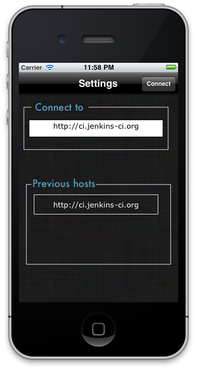
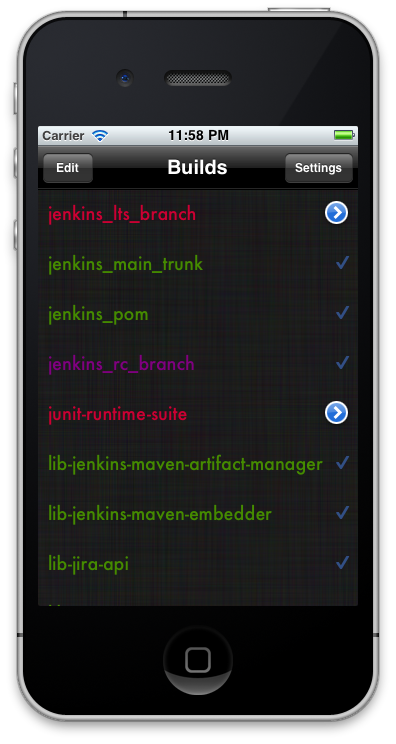
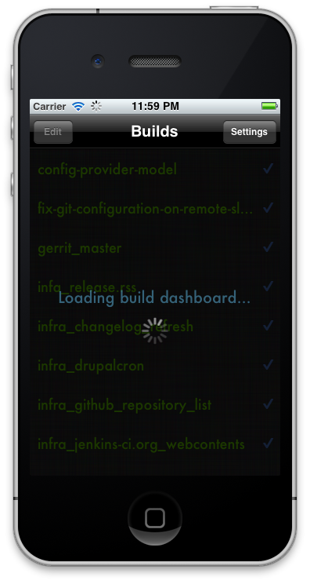
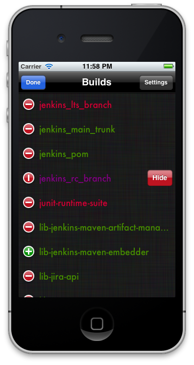
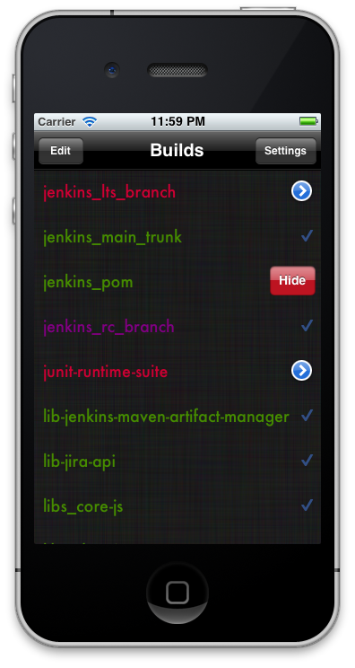
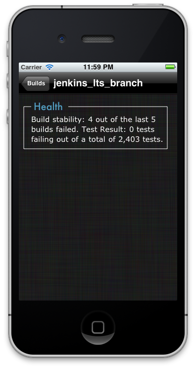

## iBroke

This is an iPhone application designed to show the status of your builds on your Jenkins CI server. You will need 
to be on the same network as the server. 

## Version
1.0

## Usage

You start the app and you go to the setting page. Enter the complete host for the Jenkins Server. 
It will keep track of the last three servers you visited. 

It should show you the builds page once you have entered the correct host.

Shake to refresh the list. 

You can remove individual builds you do not care about. 

You can also see a few extra details about a broken build

## Collaborators
People who worked on this with me:
1. Yori M
2. Mike Rowe

## Acknowledgements

This project uses:
1. UIColor+Hex and NSArray+Block categories developed by [Kevin O'Neill](https://github.com/kevinoneill/Useful-Bits).
2. ASIHTTPRequest developed by [Ben Copsey](https://github.com/pokeb/asi-http-request)
3. json-framework developed by [Stig Brautaset](https://github.com/stig/json-framework)
4. Loading view example developed by [Matt Gallagher](http://cocoawithlove.com/2009/04/showing-message-over-iphone-keyboard.html)

## License